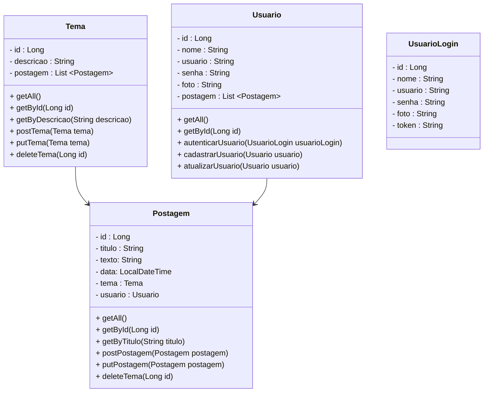

<h1 align="center">Bem-vindes ao Discoleta</h1>

<h2 align="center">Summary</h2>

    <a href="#about">📙 About</a>
    <a href="#preview">🖼️ Preview</a>
    <a href="#frontend">🎨 Front-end</a>
    <a href="#backend">☕ Back-end</a>
    <a href="#requirements">💡 Requirements</a>
    <a href="#technologies">💻 Technologies</a>
    

  
<H2 id="about">📙 About the project</H2>

Discoleta é uma Rede Social que facilita o descarte do lixo reciclável, conectando pessoas que se disponibilizam para uma rede que não tem fácil acesso a um ecoponto.
Esse projeto foi baseado na ODS 11 - Cidades e Comunidades Sustentáveis (ONU).
Pessoas maiores de 13 anos podem criar uma conta registrando um endereço de e-mail e nome de usuário.

## Funcionalidades para o usuário

- Facilidade na comunicação
- Organização divida por temas
- Resolução dos problemas causados devido a falta de coleta seletiva

## Nossos objetivos

- Divulgar a importância da reciclagem
- Disponibilizar um espaço de fácil acesso que motive o usuário a utilizá-lo
- Incentivar pessoas que vivem na mesma região a tornar o local mais sustentável

## Etapas de utilização

- Usuário preenche o formulário de cadastro
- Realização de login e senha
- Adição de novos temas e postagens
- Visualização de postagens

<h2 id="preview">🖼️ Preview</h2>

<h2 id="frontend">🎨 Front-end</h2>

<h2 id="backend">☕ Back-end</h2>

- MySQL
- CRUD
- Spring Security
- JUnit
- Swagger

## Diagrama de Classes MySQL

## CRUD

## Sping Security

## JUnit

## Swagger

  

<H2 id="technologies">💻 Tecnologias</H2>

    <a href="https://github.com/discoleta">
    
    
    
    
    
    
    
      
    
    
    
    

## Desenvolvedores

<table>
<tr>
<td align="center"><a href="https://github.com/alinerasche"> <b>Aline Rasche Lobo</b></a> </td>
<td align="center"><a href="https://github.com/DayanaTito"> <b>Dayana Tito</b></a> </td>
<td align="center"><a href="https://github.com/milenaFO"> <b>Milena Oliveira</b></a> </td> 
<td align="center"><a href="https://github.com/insivam"> <b>Vitor Rodrigues</b></a> </td> 
<td align="center"><a href="https://github.com/willjpg"> <b>Willian Ferreira</b></a> </td>
</table>
